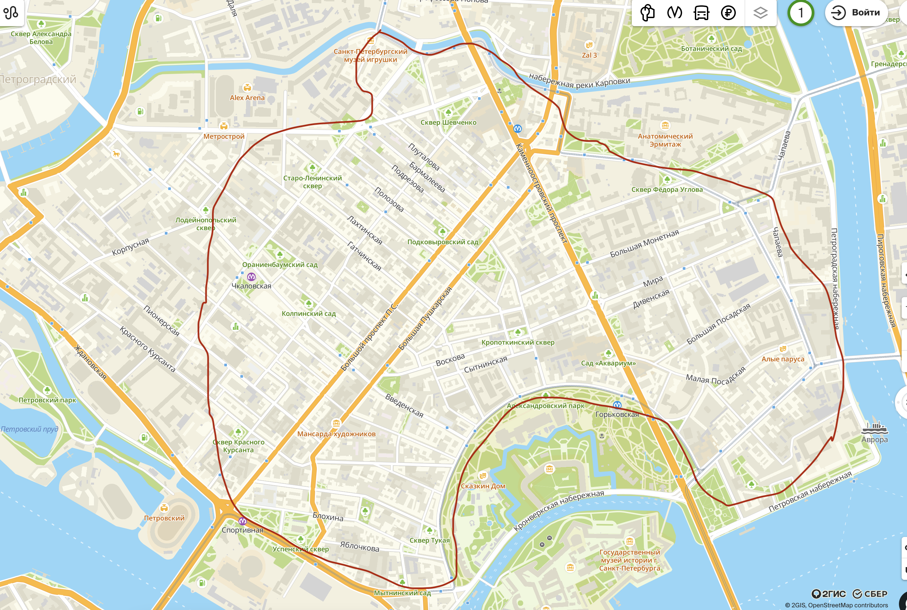
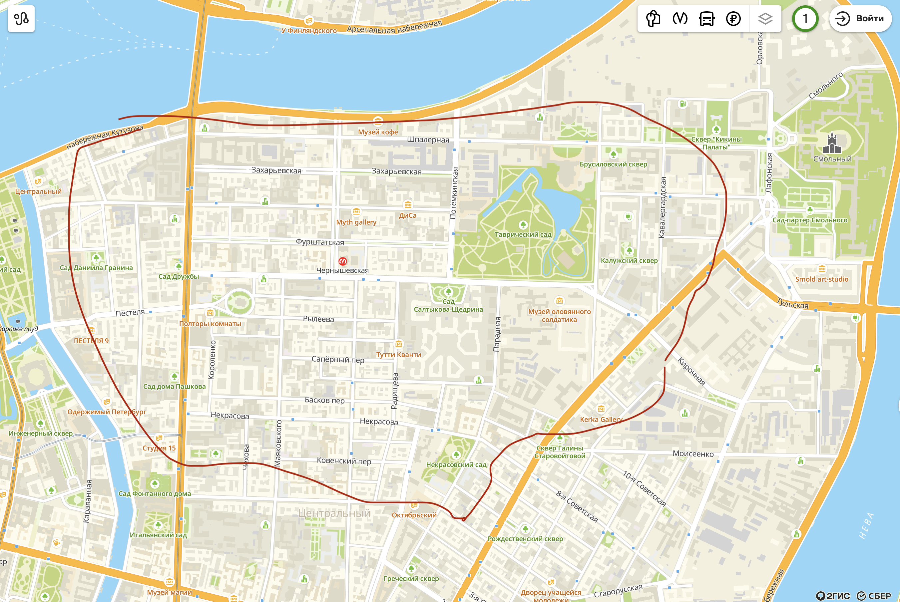
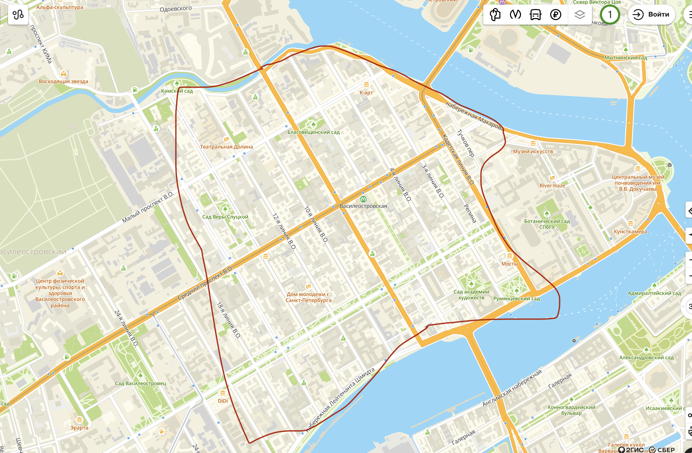
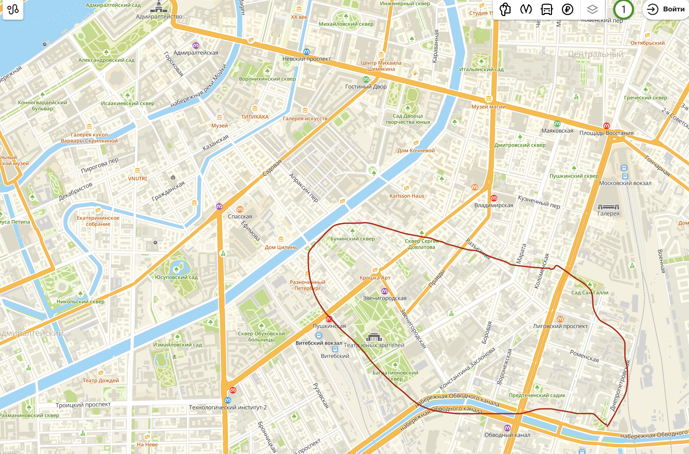
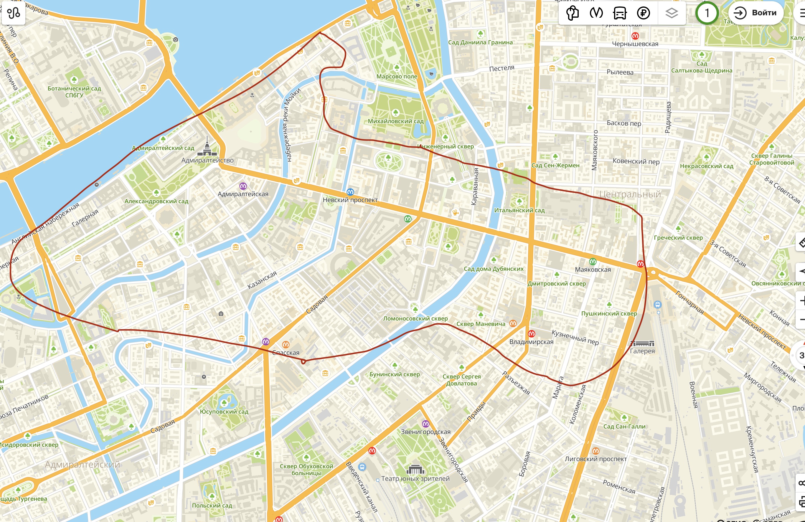
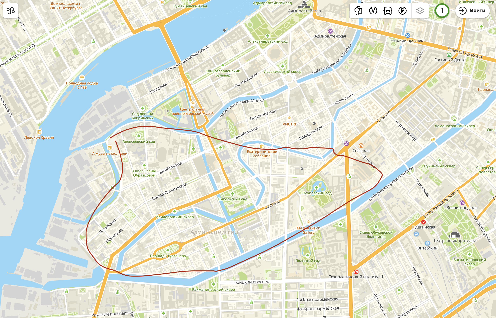
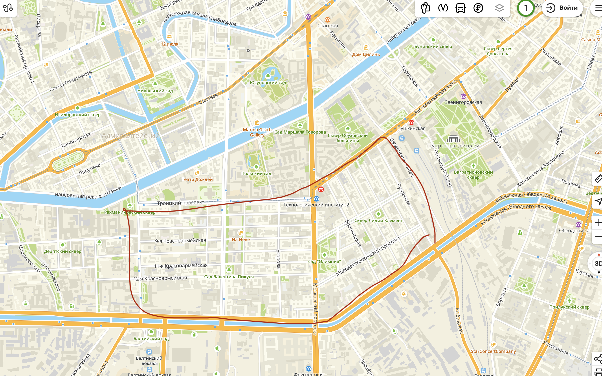

# Где вообще можно жить в Cанкт-Ленинбурге

## Лот 1 - Петроградский Остров

Детали:
- Дистанция от хаты до метро - от 10 до 20 минут
- Пробки и много тачил - на каменоостровском, большом и пушкарской
- Вероятность застрять летом в центре ночью потому что это север города и мосты разведены - есть
- Цена за 2к с икеевским ремонтом - 80к
- Степень ощущения жизни в историческом питере - максимальная
- Вероятность пожалеть - нулевая

## Лот 2 - Чернышевская ст. м.

Детали:
- Дистанция от хаты до метро - от 5 до 25 минут, как повезет
- Цена за 2к с икеевским ремонтом - понятия не имею, но дешевле чем петрога в теории
- Центр, но какбе не совсем, что по идее придется до центра чуть-чуть идти - да
- Красиво - да, две
- Вероятность пожалеть - нулевая

## Лот 3 - Васильевский Остров, восточная историческая часть

Детали:
- Дистанция от хаты до метро - от 10 до 20 минут
- Ценник ниже чем на петроге, но как повезет
- Пешкарем можно попасть вна петрогу и в центр, но чсх оба будут ощущаться так что до них нужно добираться
- Как и предыдущие лоты, это исторический спальный район и тут как водится нет чуть менее чем нихуя в плане грамотных супермаркетов, тц, развлекух, все местячковое, ламповое
- Историческая часть с красивыми домами - о да
- Вероятность пожалеть - нулевая, правда пару раз на такси домой поедешь вместо того чтобы идти пешком, если заселишься в дальний от цивилизации угол

## Лот 4 - Южный центр

Детали:
- Дистанция до метро - от 10 до 20 мин
- Южная окраина центра, еще красиво но уже не так свистит
- Еще ниче ценник, но уже какбе центр
- Здесь сравнительно нехуй делать и ты всегда идешь отсюда в одном направлении - в центр. Это все потому что с востока здесь окружено московским вокзалом и его рельсами разрезающими центр на южный и восточный, а с юга - обводным каналом, разрезающим город на Санкт Петербург и Новосибирск. (Вообще строго говоря, то что ниже обводника на станции метро Обводный Канал (АКА где жил Диман) можно отнести в этот же лот - но тоже, оттуда до центра - это уже ебашить. Отсюда идти - это еще "идти", а вот от тамбовской - уже прям "идти дохуя")
- В районе дохуя заброшек, граффити и молодежи, но это не мешает, а придает шарм
- Вероятность пожалеть - нулевая, с особенностями, но в конечном итоге нулевая. (Очень интересно сравнивать этот лот с лотом 7, позже про него будет)

## Лот 5 - Центр, туристический и исторический

Детали:
- Охуенная просадка по ценнику, 80к за норм ремонт и 2 комнаты - это история 2017ого года, сейчас же это начальная планка и прям до 240к/мес
- Дистанция от метро - от 5 до 20 мин
- Туристы, тусовки, но в западной части конечно поспокойнее. Плюс каналы все, сука, здесь, мойка, грибоедова и фонтанка, слева направо.
- Здесь тусил Ломоносов, Керенский, Юсупов, Собчак и все чёткие пацаны, а не какое-то быдло типо Цоя, Ленина и группы ДДТ
- Вероятность пожалеть - будем честными, нулевая, конечно же, но с точки зрения финансовой грамотности для нас, ебаных бедняков, тут какбе есть чё пооптимизировать

## Лот 6 - Коломна

Детали:
- На западе от центра, спальный район в котором нет нихуя по инфраструктуре и развлечениям
- Норм ценники
- Дистанция от метро - от 15 до 35 минут, охуенно удален от цивилизации, придется неиронично ездить на трамвае до сенной
- Красивый старый раён
- В течение пары лет откроют новую станцию метро, что улучшит логистику, но не прям намного
- Вероятность пожалеть - ну... ноль, если не на самом западном краю. Желательно конечно не дальше Никольского Собора/сада, а то сильно далеко пиздец

## Лот 7 - Техноложка

Детали:
- Студенты, тысячи их
- Норм ценник (?)
- Окраина центра, до центра отсюда надо идти
- Можно попасть на фрунзенскую, на ней есть новостройки, а на балтийской есть большая лента
- Вероятность пожалеть - ну... да по идее тоже нулевая, ну да, чуть чуть в стороне, ну да, толком никуда отсюда кроме как в центр некуда идти... Честно говоря этот лот заставляет меня задуматься, почему я вообще поместил 4 ый лот на 4 место, если по сути с техноложкой они одинаково удалены от центра. хз мб прост не люблю техноложку))) но норм район, можно жить, чуть дальше от центра чем лот 4, чуть дешевле (наверное, в теории) чем лот 4. Нахуя я вообще живу в лоте 4 когда есть техноложка?

